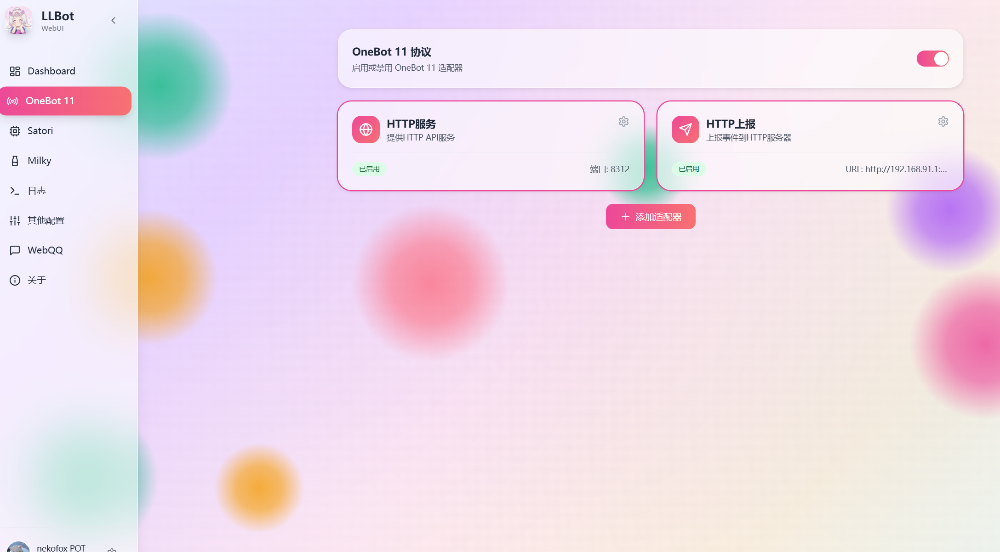
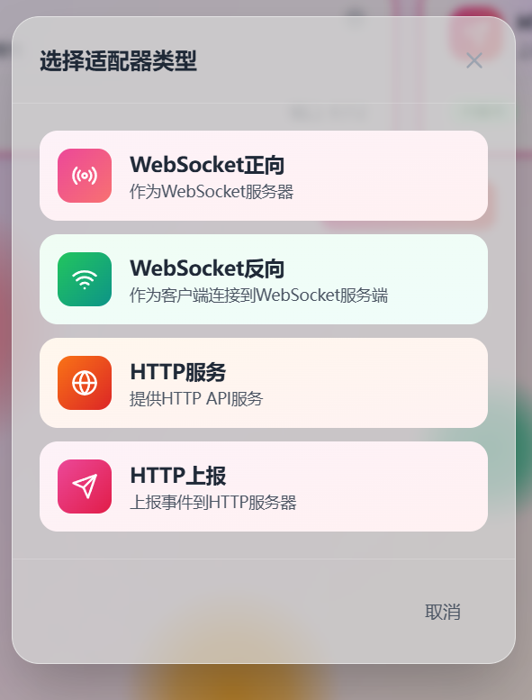
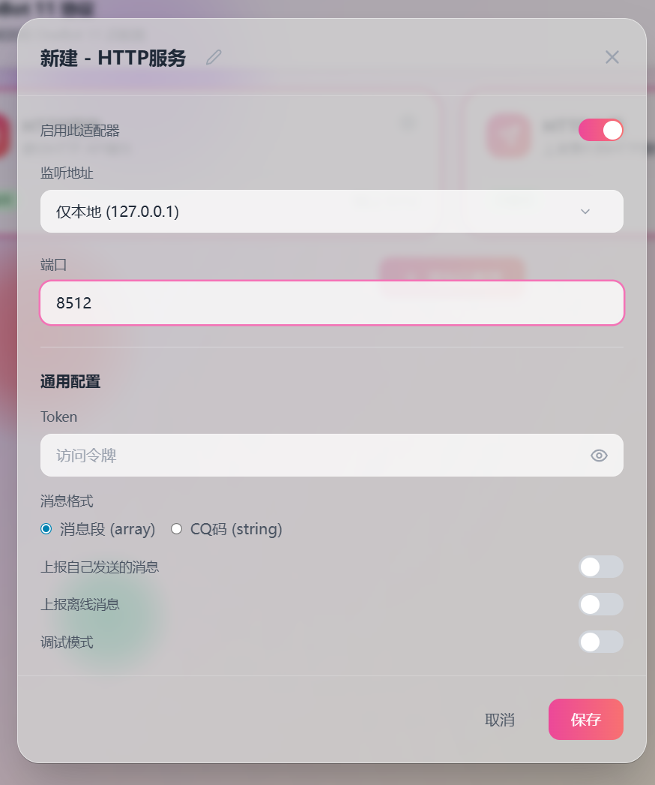
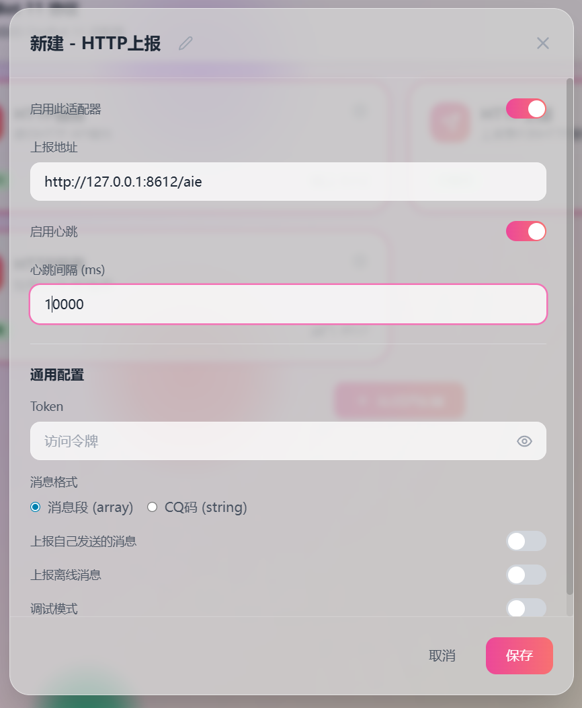

### 1.安装llbot
#### 安装方法参照以下链接
https://www.llonebot.com/guide/choice_install
### 2.配置llbot
#### 打开llbot web管理页面
#### 选到 Onebot11 选项

#### 点击添加适配器
#### 点击添加HTTP服务

#### 配置监听地址和端口（端口可自定义，默认可以填写8512）

#### 保存
### 记住地址和端口（配置aie时要考）
### 例如我的地址是127.0.0.1，端口是8512，那么llbot的http上报地址为 http://127.0.0.1:8512/
###
#### 随后再添加一个http上报
#### 上报端口可自定义，默认为8612

#### 记住 http://127.0.0.1:8612/aie 里的 “8612”，这个可以自定义，待会也要考。
#### 心跳上报可选，配置aie的时候要考。
#### 保存
### 至此，llbot配置结束